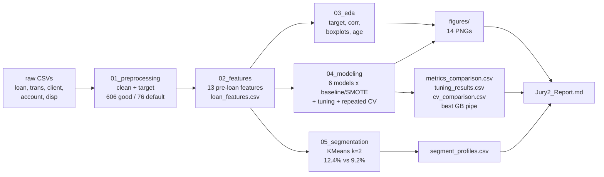

# Customer Behavioral Analysis & Loan Default Classification

## Overview
This repository folder contains the code, data, and documentation for the Jury 2 project, fulfilling the requirements for Units III & IV (Data Mining, Preprocessing, and Classification).

The project applies machine learning algorithms to the PKDD'99 Financial Dataset to classify and predict **Loan Default Risk** based on customer transaction behavior.

## Pipeline



## Directory Structure
- `/data/`: Raw PKDD'99 CSV files (`trans.csv`, `loan.csv`, `client.csv`, etc.) plus the engineered `loan_features.csv` (682 loans, 27 columns).
- `/docs/`: `Problem_Statement.md` (the jury problem statement), `Jury2_Report.md` (final report), `jury2_requirements.md` (task checklist), `SYNOPSIS.md`, `SYSTEM_REQUIREMENTS.md` (reproduction guide), `REFERENCES.md`.
- `/notebooks/`: Executed Jupyter notebooks, run in order:
  1. `01_preprocessing.ipynb` (cleaning, target definition: 606 good vs 76 default)
  2. `02_features.ipynb` (pre-loan behavioral features, leakage-checked)
  3. `03_eda.ipynb` (target balance, correlations, behavior comparisons, risk quadrant)
  4. `04_modeling.ipynb` (Decision Tree, Naive Bayes, Random Forest, SVM, KNN, Gradient Boosting; baseline vs SMOTE, randomized hyperparameter search, repeated 5-fold x 10 cross-validation, model selection, persisted best pipe)
  5. `05_segmentation.ipynb` (KMeans behavior segments: quieter low-balance vs active; default rate per segment)
- `/outputs/`: `metrics_comparison.csv` (12 runs, single split), `tuning_results.csv` (12 hyperparameter searches), `cv_comparison.csv` (24 rows, 50 estimates each, the selection table), `segment_profiles.csv`, `models/best_GradientBoosting_baseline_tuned.pkl`, and `figures/` (14 PNGs: target distribution, target correlations, full feature correlations, boxplots, age histogram, risk quadrant, confusion matrices, ROC curves, precision-recall curves, CV selection, tuning curves, RF importance, segment default rates, segment scatter).

## Project Objectives
1. Perform complete data preprocessing and feature engineering.
2. Conduct Exploratory Data Analysis (EDA) on customer transaction behaviors.
3. Train classification models (Decision Tree, Naïve Bayes, Random Forest, SVM, KNN, Gradient Boosting).
4. Tune hyperparameters and select the final model by repeated cross-validation.
5. Evaluate model performance using Accuracy, Precision, Recall, F1-Score, Average Precision, and ROC-AUC.
6. Cover the rubric requirement for pattern matching / association-rule mining, including FP-Growth and Apriori, as a supplementary behavioral-analysis layer.

## Pattern Matching (FP-Growth, Apriori)
This project’s core task is classification, but the judging rubric also expects evidence of pattern mining. To satisfy that requirement, the research includes a supplementary association-rule perspective on transaction behavior. The raw transaction log is treated as a basket-style dataset to reveal recurring combinations such as regular deposits, cash withdrawals, low-balance patterns, and overdraft-like behavior. Standard rule-mining methods such as Apriori and FP-Growth are discussed as suitable techniques for identifying frequent behavioral patterns, while the final predictive system remains focused on loan default classification.

## Headline Result
Tuned Gradient Boosting on unresampled data is the selected model: repeated cross-validated F1 0.571 ± 0.120, Average Precision 0.654, ROC-AUC 0.864. Tuned Random Forest ties it on F1 and leads on Average Precision (0.661) and ROC-AUC (0.877), so the two are one leading group. Two findings from the testing: SMOTE lowered F1 for five of the six models, and hyperparameter search mattered mainly for SVM and Decision Tree. Low pre-loan balances (`min_balance`, `balance_at_loan`) are the strongest default signals, and crossing pre-loan balance with loan amount separates the portfolio from 4.9% to 23.3% default. Behavior segmentation finds two groups: a quieter low-balance segment defaulting at 12.4 percent versus 9.2 percent for the active segment. Details in `docs/Jury2_Report.md`.

## How to Run
Install dependencies with `pip install -r requirements.txt`, then execute the notebooks in order (01 to 05). Each notebook is self-contained and runs top to bottom, for example:

```bash
py -m nbconvert --to notebook --execute notebooks/01_preprocessing.ipynb --output 01_preprocessing.ipynb
```
